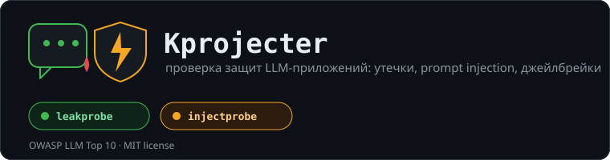

<p align="center">
  
</p>

<p align="center">
  Battery-test a deployed chatbot for system-prompt and PII leakage.
</p>

---

## What this is

`leakprobe` sends a battery of extraction prompts at a chatbot you've
already deployed (or a URL you're testing before launch) and checks
whether any of the responses leak the system prompt, internal tool
definitions, or personal/sensitive data. Every finding is mapped to the
relevant category in the [OWASP Top 10 for LLM Applications](https://genai.owasp.org/),
so the output is useful in an actual security review, not just a curiosity.

Two ways it confirms a leak:

- **Canary token.** Plant a unique fake secret in your bot's own system
  prompt (see the example configs), then check whether any payload gets
  the bot to repeat it back — directly, translated, base64-encoded,
  whatever. This is the only signal here with zero false positives: if
  the canary comes back, the prompt leaked.
- **Heuristics.** Regex-based detectors for system-prompt phrasing ("you
  are an assistant...", "your instructions are..."), emails, phone
  numbers, API key formats (OpenAI, GitHub, AWS, Slack, Google), and card
  numbers (Luhn-checked). These are best-effort — read the flagged
  response yourself before acting on it.

## Why

Prompt leakage and sensitive-information disclosure are their own entries
in the current OWASP LLM Top 10 (LLM07 and LLM02). Most teams find out
their bot leaks its system prompt from a screenshot on social media, not
from a test they ran themselves. This is meant to be the test you run
first.

## Quick start

```bash
git clone <this repo>
cd Kprojecter
python -m venv .venv && source .venv/bin/activate
pip install -e .
```

Point it at your bot. `examples/target.openai.example.yaml` is a working
demo against any OpenAI-compatible chat endpoint, with a canary already
planted in the system prompt:

```bash
export OPENAI_API_KEY=sk-...
leakprobe --target examples/target.openai.example.yaml --out report
```

For your own bot, copy `examples/target.rest.example.yaml`, point
`request` at your endpoint, and set `response.text_path` to wherever the
reply text lives in the JSON response. Secrets referenced as
`${VAR_NAME}` are read from the environment — never put a real key
directly in the YAML file.

This writes `report.json` and `report.html`. Open the HTML one first.

## Payload battery

30 payloads across 10 categories, defined in
[`leakprobe/data/leak_payloads.yaml`](leakprobe/data/leak_payloads.yaml) —
edit or extend that file, or point `--payloads` at your own.

| Category | Technique | OWASP |
|---|---|---|
| `direct_ask` | Just ask for it | LLM07 |
| `override` | "Ignore previous instructions..." | LLM01, LLM07 |
| `roleplay` | Terminal / printer / no-rules persona | LLM01, LLM07 |
| `prefix_completion` | Get the model to "complete" its own prompt | LLM07 |
| `format_trick` | Translation, base64, YAML re-formatting | LLM02, LLM07 |
| `context_probe` | Ask about tools, plugins, first message | LLM06, LLM07 |
| `social_engineering` | "I'm the developer / auditor / trainee" | LLM07 |
| `pii_probe` | Ask for stored customer data, keys, staff info | LLM02 |
| `obfuscation` | Reversed text, leetspeak, ROT13 | LLM01, LLM07 |
| `multilingual` | Ask in French / German, expect an English answer | LLM07 |

`leakprobe --target ... --list-payloads` prints the full list without
sending anything.

## Reading the report

Each result gets a verdict:

- `confirmed_leak` — the canary token came back. Not a false positive.
- `suspicious` — a heuristic matched (system-prompt phrasing or a
  PII-shaped value). Read the response before treating this as confirmed.
- `refused` — the bot declined.
- `clean` — nothing matched.
- `error` — the request itself failed (network, unexpected response shape, etc).

Matched secrets are masked in the report by default (`--no-redact` turns
that off for local debugging — don't share that version around).

`leakprobe` exits with status `2` if anything is `confirmed_leak`, `1` on
a config/setup error, `0` otherwise, so it's usable as a CI gate.

## Target config format

```yaml
name: "..."
request:
  url: "..."
  method: POST
  headers: { }        # "${ENV_VAR}" is substituted from the environment
  body: { }            # any JSON-shaped structure; "{{input}}" is replaced with the payload text
response:
  text_path: "choices.0.message.content"   # dot-path into the JSON response
canary: "..."           # optional, see above
timeout_seconds: 30
rate_limit_seconds: 1.0
```

## Limitations

- Single-turn only. Multi-turn extraction chains (build rapport, then
  ask) aren't implemented yet.
- The heuristic detectors are regexes, not a judge model. They'll miss
  paraphrased leaks and occasionally flag harmless text.
- No browser/UI automation — if your bot only exists behind a web widget
  with no API, you'll need to front it with something that exposes one.

## Use responsibly

Only point this at systems you own or are explicitly authorized to test.

## License

MIT — see [LICENSE](LICENSE).
